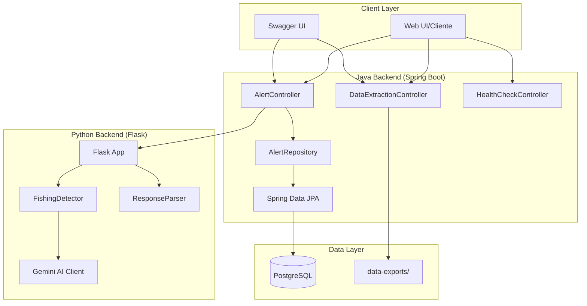
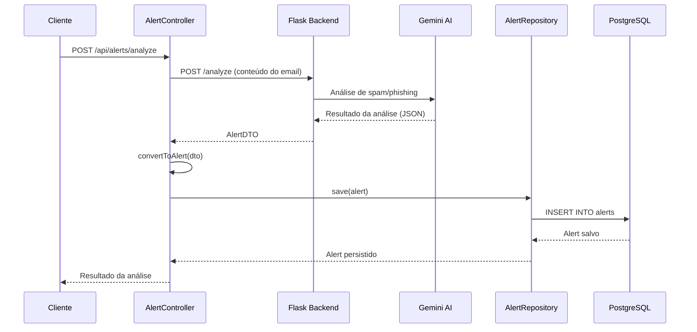

# Sistema Anti-Fraude Itaú

Sistema para detecção e prevenção de fraudes bancárias, desenvolvido como projeto universitário para o Itaú. O projeto é composto por uma API principal em Java (Spring Boot) e um backend auxiliar em Python que utiliza IA para análise de e-mails suspeitos.

## Estrutura do Projeto

- **Java (Spring Boot)**: API principal para gerenciamento de alertas com documentação Swagger/OpenAPI
- **Python Backend**: Serviço Flask que utiliza o modelo Gemini AI para detectar spam/phishing em e-mails
- **PostgreSQL**: Banco de dados relacional para persistência dos dados de alertas
- **Docker**: Facilita a execução dos serviços em containers

## Arquitetura do Sistema

### Componentes Principais



### Fluxo de Análise de Email



## Como Executar

### 1. Pré-requisitos

- Docker e Docker Compose instalados
- Java 21+ (caso queira rodar sem Docker)
- Python 3.12+ (caso queira rodar o backend Python localmente)

### 2. Configuração de Variáveis de Ambiente

- Edite o arquivo [.env](.env) na raiz para configurar o banco de dados
- O backend Python utiliza [src/python-backend/.env](src/python-backend/.env) para a chave da API Gemini

### 3. Subindo com Docker

```sh
docker compose up
```

- A aplicação Java estará disponível em `http://localhost:8080`
- O backend Python estará em `http://localhost:5000`
- O banco PostgreSQL estará em `localhost:5433`
- pgAdmin estará em `http://localhost:8888`
- Documentação Swagger UI: `http://localhost:8080/swagger-ui/index.html`

### 4. Rodando o Backend Python manualmente

Entre na pasta [src/python-backend](src/python-backend) e execute:

```sh
pip install -r requirements.txt
python app.py
```

### 5. Testando a API

- Acesse `http://localhost:8080/` para verificar se a API Java está rodando
- Acesse `http://localhost:5000/` para testar a análise de e-mails via IA
- Acesse `http://localhost:8080/swagger-ui/index.html` para a documentação interativa da API

## Funcionalidades da API

### Controllers Disponíveis

#### 1. AlertController (`/api/alerts`)
Gerenciamento completo de alertas de spam/phishing:

**Análise de Emails:**
- **POST** `/api/alerts/fetch` - Analisa email de exemplo via Python backend
- **POST** `/api/alerts/analyze` - Analisa conteúdo de email fornecido

**Consultas:**
- **GET** `/api/alerts` - Lista todos os alertas
- **GET** `/api/alerts/{id}` - Busca alerta específico
- **GET** `/api/alerts/spam` - Lista apenas alertas de spam
- **GET** `/api/alerts/legitimate` - Lista apenas alertas legítimos
- **GET** `/api/alerts/high-confidence` - Alertas com alta confiança (>0.8)
- **GET** `/api/alerts/count` - Contagem total de alertas
- **GET** `/api/alerts/count/spam` - Contagem de alertas de spam
- **GET** `/api/alerts/health` - Health check do controlador

**Atualizações:**
- **PUT** `/api/alerts/{id}` - Atualiza alerta completo
- **PATCH** `/api/alerts/{id}/spam-status` - Atualiza status de spam
- **PATCH** `/api/alerts/{id}/confidence` - Atualiza nível de confiança
- **PATCH** `/api/alerts/{id}/subject` - Atualiza assunto
- **PUT** `/api/alerts/bulk-update-spam` - Atualização em lote

**Exclusões:**
- **DELETE** `/api/alerts/{id}` - Remove alerta específico
- **DELETE** `/api/alerts/bulk-delete` - Remoção em lote
- **DELETE** `/api/alerts/spam` - Remove todos os alertas de spam
- **DELETE** `/api/alerts/low-confidence` - Remove alertas com baixa confiança

#### 2. DataExtractionController (`/api/data-extraction`)

O Itaú, como uma das maiores instituições financeiras do Brasil, precisa atender rigorosos **requisitos de compliance bancário** e **auditoria externa**. O [`DataExtractionController`](src/main/java/com/itau/antifraud/controller/DataExtractionController.java) foi desenvolvido para preparar o sistema para futuras implementações de **Change Data Capture (CDC)** e auditoria.

**Contexto e Benefícios:**

1. **Rastreabilidade Completa**: Quando implementado, o sistema CDC registrará todas as mudanças nos dados de alertas em arquivos JSON no diretório `data-exports/`

2. **Auditoria Externa**: Auditores poderão acessar extratos das operações para verificar conformidade com LGPD, PCI-DSS e regulamentações bancárias

3. **Análise de Tendências**: Permitirá análise histórica dos padrões de fraude para melhorar a detecção

**Endpoints Disponíveis:**
- **GET** `/api/data-extraction/files` - Lista arquivos exportados (filtro por operação)
- **GET** `/api/data-extraction/files/count` - Conta arquivos por tipo de operação
- **GET** `/api/data-extraction/files/{filename}` - Download de arquivo específico
- **DELETE** `/api/data-extraction/files` - Limpeza de arquivos antigos
- **GET** `/api/data-extraction/status` - Status do sistema de extração

**Exemplo de Uso Futuro:**
```bash
# Listar todos os alertas criados hoje
GET /api/data-extraction/files?operation=CREATE

# Contar operações por tipo
GET /api/data-extraction/files/count

# Baixar arquivo específico para análise
GET /api/data-extraction/files/CREATE_20241201_143022.json

# Limpar arquivos antigos (manter últimos 100)
DELETE /api/data-extraction/files?keep=100
```

**Estrutura de Arquivos Esperada:**
```
data-exports/
├── CREATE_20241201_143022.json    # Alerta criado
├── UPDATE_20241201_150000.json    # Alerta atualizado
├── DELETE_20241201_160000.json    # Alerta removido
└── ...
```

#### 3. HealthCheckController
- **GET** `/` - Verifica se a aplicação está funcionando

#### 4. Backend Python (Flask)
- **GET** `/` - Analisa email de exemplo
- **POST** `/analyze` - Analisa conteúdo de email fornecido
- **GET** `/api/hello` e `/api/goodbye` - Endpoints de teste

## Tecnologias Utilizadas

- **Backend Java**: Spring Boot 3.x, Java 21
- **IA/ML**: Python 3.12, Flask, Google Gemini AI
- **Banco de Dados**: PostgreSQL com Spring Data JPA
- **Documentação**: Swagger/OpenAPI 3 (SpringDoc)
- **Containerização**: Docker Compose
- **Gerenciamento**: Maven Wrapper

## Estrutura do Banco de Dados

### Tabela Alert
```sql
CREATE TABLE alert (
    id BIGSERIAL PRIMARY KEY,
    confidence DOUBLE PRECISION NOT NULL,
    is_spam BOOLEAN NOT NULL,
    subject VARCHAR(255),
    email_content TEXT,
    time_detected TIMESTAMP NOT NULL
);
```

## Documentação da API

A documentação completa está disponível via Swagger:
- **Interface Interativa**: `http://localhost:8080/swagger-ui/index.html`
- **OpenAPI JSON**: `http://localhost:8080/v3/api-docs`

A documentação inclui:
- Descrição detalhada de todos os endpoints
- Exemplos de requisições e respostas
- Códigos de status HTTP
- Interface interativa para testar endpoints

## Observações Importantes

1. **Chave API Gemini**: Configure `GEMINI_API_KEY` em [src/python-backend/.env](src/python-backend/.env)
2. **Comunicação entre Serviços**: Java se comunica com Python via REST
3. **Persistência**: Alertas são automaticamente salvos no PostgreSQL após análise
4. **Containerização**: Todos os serviços rodam via Docker Compose
5. **Desenvolvimento**: Use Maven Wrapper para build local
6. **Sistema CDC**: O DataExtractionController está preparado para futura implementação de auditoria

## Estrutura de Arquivos

```
├── src/
│   ├── main/java/com/itau/antifraud/
│   │   ├── controller/          # Controllers REST
│   │   ├── model/              # Entidades JPA
│   │   ├── repository/         # Repositórios Spring Data
│   │   └── dto/                # DTOs para comunicação
│   ├── python-backend/         # Serviço Flask + Gemini AI
│   └── test/                   # Testes unitários
├── compose.yml                 # Docker Compose
├── pom.xml                     # Dependências Maven
└── README.md                   # Esta documentação
```

## Cenário de Uso - Itaú

**Situação**: Analista do Itaú detecta aumento de 300% em tentativas de phishing

1. **Análise**: Usa `/api/alerts/analyze` para processar emails suspeitos via Gemini AI
2. **Monitoramento**: Consulta `/api/alerts/high-confidence` para alertas críticos
3. **Auditoria**: Quando o CDC for implementado, usará `/api/data-extraction/files` para compliance
4. **Relatórios**: Exporta dados para apresentar à diretoria e órgãos reguladores

Este sistema garante que o Itaú tenha controle total sobre detecção de fraudes e conformidade regulatória.

